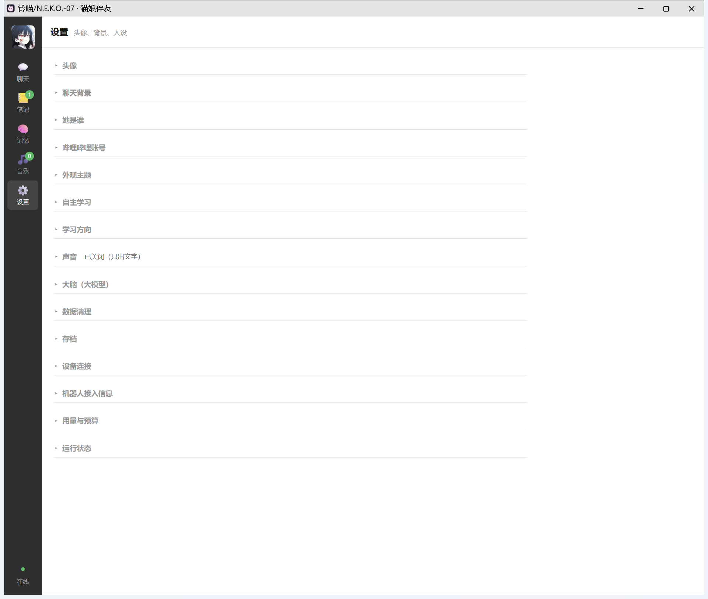

# 蕴 · NekoPal

**English** | [中文](README.md)

> A local-first desktop companion ("AI伴友"): she chats with you, **has long-term memory**,
> and **teaches herself from Bilibili** — then tells you what she learned.

NekoPal is a Windows desktop app that puts an AI companion in a WeChat-like window.
Everything runs on your own machine: your API key, your SQLite memory, your browser profile.
There is no server of ours and no telemetry.

---

## What she does

| | |
|---|---|
| **Chat** | Streaming replies from DeepSeek (or any OpenAI-compatible endpoint), with a configurable persona: name, how she addresses you, 4 style presets (清冷智者 / 软萌甜妹 / 温柔学姐 / 毒舌傲娇), keywords, and a free-form prompt |
| **Memory** | SQLite store of messages + extracted long-term memories, searchable from the chat search box |
| **Self-study** | On a schedule (default 12:30 / 21:00, plus every N hours) she picks a video from your topic list, pulls **subtitles if you're logged in**, otherwise falls back to **danmaku + comments** ("audience view"), distils 3+ knowledge points into a note, then quizzes you |
| **Music** | Log into NetEase Cloud Music / QQ Music by QR code, she reads your listening history, picks a song, and tells you something about it (taste learning: 👍/👎 per song) |
| **Notes** | Every study session becomes a note with a **content-level badge** (subtitles / audience view / description only / title only) so you know how trustworthy it is |
| **Saves** | Game-save-like snapshots of conversation + memory + notes; auto-snapshot on quit, resume on start |
| **Devices** | Optional HTTP gateway for a desktop robot / smart home: **whitelisted devices and actions only**, dangerous actions require confirmation |
| **Motion** | Wheeled-robot commands with hard caps on speed / duration / distance |
| **Budget** | Daily ¥ cap, duplicate-message guard, per-minute rate limit, live balance readout |

### Device connection & control (optional, **off by default**)

She is the **brain**; a gateway is the **hands** — she never touches hardware directly:

```
NekoPal (PC: persona / memory / LLM)  --HTTP + Bearer-->  gateway  -->  devices
                                                          (MQTT / HTTP / serial / Home Assistant)
```

Configure it in Settings → 「设备连接」 (no JSON editing needed): master switch, gateway address with a
「测试连接」 button, the device whitelist, and a 「机器人接入信息」 panel that hands your firmware the
LAN address, an access token and the 5 endpoints it can call.

The gateway contract is a single call:

```
POST /action  {"device": "desk_light", "action": "light.on"}  ->  {"ok": true, "state": "on"}
```

so swapping devices or protocols never touches the app. `tools/mock_gateway.py` runs the whole loop
with no hardware at all.

**Three safety gates — the physical world has no "load save":**

1. **Whitelist.** Only devices/actions listed in `devices.list` are executed. An LLM *will* hallucinate
   devices you don't own ("turn on the living-room humidifier"); unlisted ones are refused, and she
   tells you what *is* available instead.
2. **Confirmation for dangerous actions** (`dangerous: true`). She parks the request, says
   "I won't touch it until you confirm", and only sends it after you say 确认 (over HTTP you must pass it
   in `confirm`).
3. **Audit trail.** Every action — success or failure — is written to an `actions` table and readable via
   `GET /api/actions`. It is the only way to reconstruct what happened.

Robots on Wi-Fi also need the app reachable from the LAN: turning on 「允许局域网接入」 moves the server
to `0.0.0.0` and **auto-generates an access token**. Requests from `127.0.0.1` stay unauthenticated (the
UI itself connects that way); anything from the LAN must send `Authorization: Bearer <token>`.

Firmware endpoints: `POST /api/chat`, `GET /api/chat/stream` (SSE), `GET /api/events` (SSE push — she
starts conversations herself), `POST /api/action`, `GET /api/status`.

Motion commands (`neko/motion.py`) are separately capped on **speed / duration / distance**.



## Quick start (Windows)

```powershell
git clone https://github.com/Roeviel/NekoPal.git
cd NekoPal
```

1. Double-click **`安装依赖.bat`** — creates `.venv`, installs dependencies, optionally creates a desktop shortcut.
2. It will copy `config.example.json` → `config.json`. Put your `llm.api_key` in there
   (works without a key too — she falls back to offline canned replies).
3. Double-click **`启动蕴.vbs`** — starts the server and opens the app window.

Diagnostics, all offline unless noted:

```powershell
.venv\Scripts\python.exe tools\selfcheck.py     # deps / config / memory / persona / brain / Bilibili / scheduler / voice / server
.venv\Scripts\python.exe tools\e2e_check.py     # full pipeline against a local mock LLM
.venv\Scripts\python.exe tools\zz_ui_check.py   # clicks through the UI via CDP (needs the app running)
```

## Configuration

Everything lives in `config.json` (created from `config.example.json`).
Highlights: `llm.*`, `persona.*`, `bilibili.topics`, `devices.*`, `motion.*`, `budget.*`, `schedule.*`.

The UI is **Chinese only** for now — localisation PRs are very welcome.

## What is deliberately *not* in this repo

| Not included | Why | What you do |
|---|---|---|
| `config.json` | contains your API key, Bilibili cookie and gateway token | generate it from `config.example.json`; `.gitignore` already blocks it |
| `data/` | chat history, memory DB, browser profile, ASR models | created on first run |
| Sticker images | everyone's collection differs, and they are usually someone else's artwork | drop your own into `data/stickers/` |

## Requirements

- **Windows** (the launcher scripts are `.bat` / `.vbs`; the server itself is plain Python and can run elsewhere)
- **Python 3.12+** (developed and tested on 3.14)
- A **DeepSeek API key** for real conversation (otherwise offline fallback)

## Privacy & safety notes

- The app binds to `127.0.0.1` only. Your API key and cookies never leave your machine except to the
  services you configured (DeepSeek, Bilibili, NetEase).
- `config.json` holds real credentials in plain text — **never commit or share it**.
- Device/motion control is whitelist-based, with caps and confirmation for dangerous actions.

## Compliance

- Bilibili data is fetched through **public, unauthenticated endpoints** (plus your own cookie if you log in),
  used only for local summaries. No bulk scraping, no redistribution. Follow Bilibili's ToS.
- Impersonation, scams, harassment and anything that violates other people's rights are not acceptable uses.

## License

[MIT](LICENSE) — use it, fork it, change it; keep the copyright notice.

---

The full documentation (architecture, measured numbers, and a long list of pitfalls that were actually
hit while building this) is in the Chinese README: **[README.md](README.md)**.
